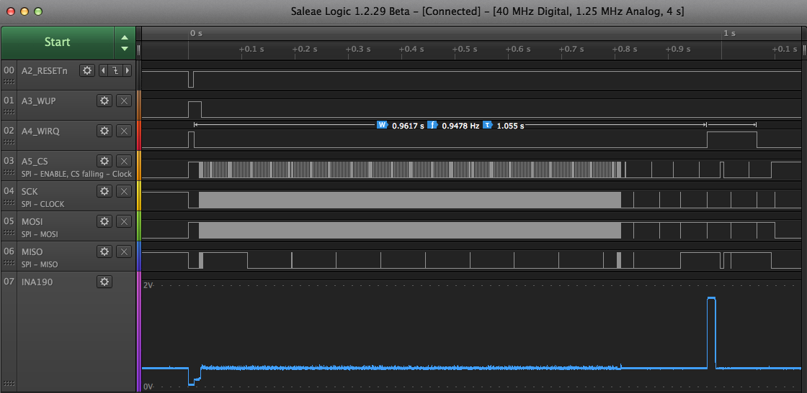
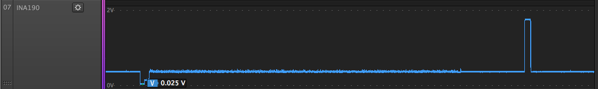
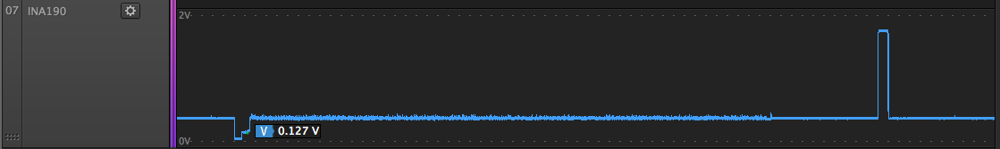
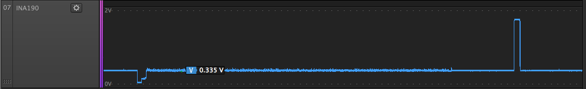
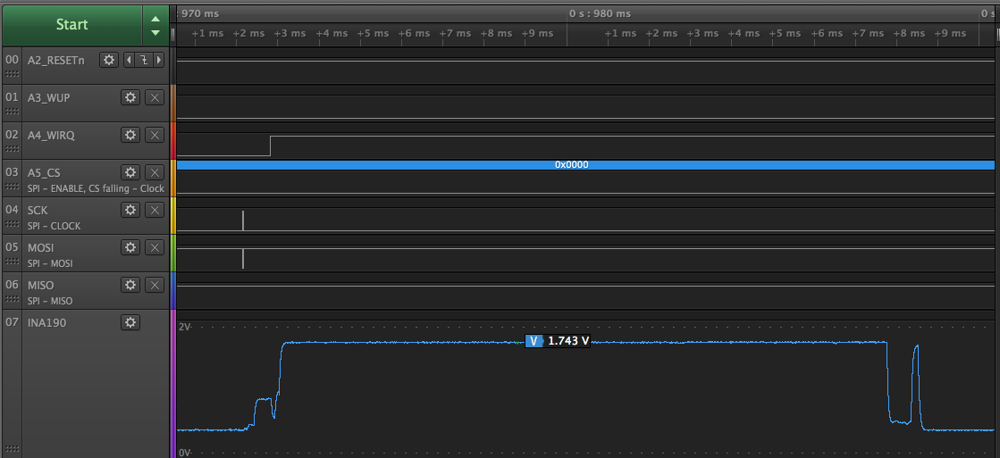
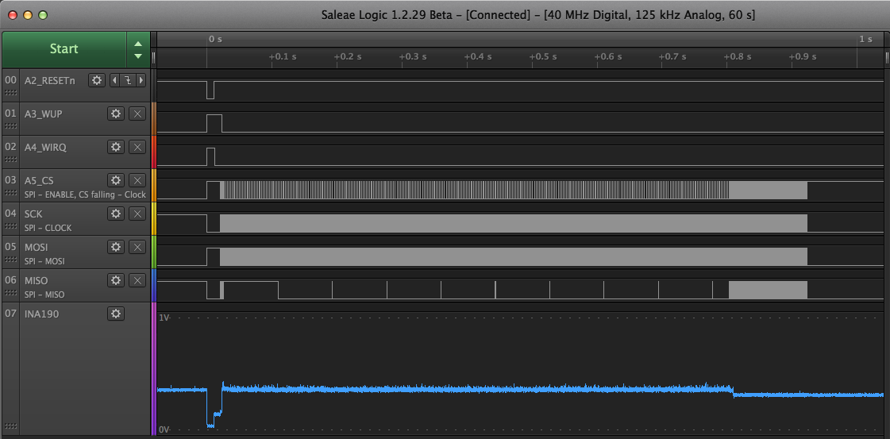
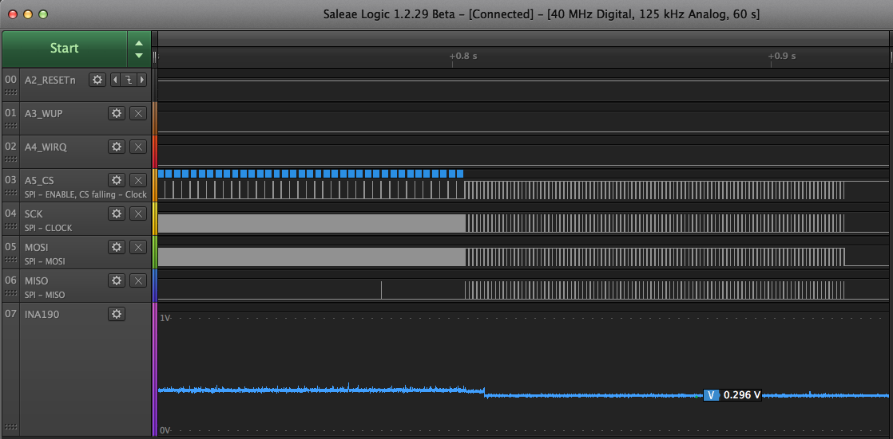

# exp14

Objectives:

1. Get SPI working between Feather M4 and WF200 eval board

2. Trace WF200 eval board current with Saleae during firmware upload

3. Compare current sense capture for valid vs. invalid firmware blob


## Current Sense Captures

Saleae Logic 8 captures of 200V/V gain INA190 high-side current sense amplifier
inline with WF200 eval board VMCU.

Saleae Logic 8 calibrated voltage quantization step size appears to about
1.35mV, corresponding to a current measurement step size of 52µA (200 V/V gain
across 0.130Ω).

| INA190 Vout | gain    | R       | I (Vout/gain/R) | Comment                             |
|-------------|---------|---------|-----------------|-------------------------------------|
| 0.025 V     | 200 V/V | 0.130 Ω |  0.962 mA       | Start of reset                      |
| 0.127 V     | 200 V/V | 0.130 Ω |  4.88  mA       | Mid-reset                           |
| 0.335 V     | 200 V/V | 0.130 Ω | 12.9   mA       | Firmware uploading                  |
| 1.743 V     | 200 V/V | 0.130 Ω | 67.0   mA       | Peak after `HOST_STATUS_OK_TO_JUMP` |
| 0.296 V     | 200 V/V | 0.130 Ω | 11.4   mA       | After invalid firmware upload       |













## Capture of Uploading Invalid Firmware Blob

This capture shows the error condition after uploading a firmware blob that I
corrupted by flipping one bit a ways after the header. There's no code or
console log to go with this, but the WF200 did not return a
`HOST_STATUS_OK_TO_JUMP` status code at the end of the upload.






## Console Log (Arduino serial monitor)

This uses the zero-buf branch of samblenny/wfx-fullMAC-driver at commit
[54842b4](https://github.com/samblenny/wfx-fullMAC-driver/commit/54842b4931d10a7119db337ba30ed2ff5dd6d959)

See [console_log_1.txt](console_log_1.txt)


## PDS File Setup

The purpose of a PDS file is to configure the WF200 radio and GPIO. For the
BRD8022A "WF200 Wi-Fi EXP Board" evaluation board from Silicon Laboratories,
there is a header file for the pre-defined PDS at
https://github.com/SiliconLabs/wfx-fullMAC-tools/blob/master/PDS/brd8022a_pds.h

To get the PDS header file, do this, starting from `exp14/`:
```
cd ../
mkdir -p wfx-fullMAC-tools/PDS
cd wfx-fullMAC-tools/PDS
curl -O https://raw.githubusercontent.com/SiliconLabs/wfx-fullMAC-tools/master/PDS/brd8022a_pds.h
# and a workaround for the Arduino IDE library include path...
cd ../../exp14
mkdir PDS
ln -s ../../wfx-fullMAC-tools/PDS/brd8022a_pds.h PDS/brd8022a_pds.h
```
