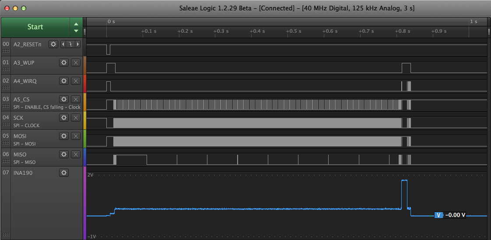
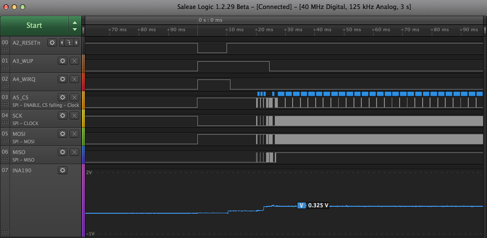

# exp15

Objectives:

1. Get PDS table upload working over hardware SPI


## Current Sense Captures

This shows a successful call to `sl_wfx_init()` followed by `sl_wfx_deinit()`.
They reset the WF200, load the firmware, boot it, load the PDS table, then
shut down the WF200. The Saleae measures 0mV from the INA190 for the shutdown
mode, which indicates current draw somewhere between 0µA and 52µA (one LSB).






## Console Log (Arduino serial monitor)

This uses the zero-buf branch of samblenny/wfx-fullMAC-driver at commit
[54842b4](https://github.com/samblenny/wfx-fullMAC-driver/commit/54842b4931d10a7119db337ba30ed2ff5dd6d959)

See [console_log_1.txt](console_log_1.txt)


## Test Circuit Wiring Guide

```
    Adafruit   Saleae   Silicon Laboratories   INA190EVM
  Feather M4   Logic8   BRD8022A EXP header    current sense
------------   ------   --------------------   -------------
         GND     GND    1  GND                 GND
          A2   0 blk    7  RESETn              --
          A3   1 brn    3  GPIO_WUP            --
          A4   2 red    12 SPI_WIRQ            --
          A5   3 org    10 SPI_CS              --
         SCK   4 yel    8  SPI_SCLK            --
        MOSI   5 grn    4  SPI_MOSI            --
        MISO   6 blu    6  SPI_MISO            --
(fake CS) 12     --     --                     --
   (5V)  USB     --     --                     VS  (INA190 Vs)
         3V3     --     20 3V3                 IN+ (0.130Ω shunt)
          --     --     2  VMCU                IN- (0.130Ω shunt)
          --   7 vlt    --                     OUT
```

Notes:
1. BRD8022A WF200 eval board switches should be set for "EXP VMCU" and "SPI".
2. BRD3022A needs 3.3V into both `3V3` and `VMCU`. `3V3` powers the GPIO mux
   chips and part of the reset circuit. `VMCU` powers the WF200 chip and the
   other part of the reset circuit.
3. INA190EVM is the 200 V/V gain variant (EVM kit comes with several boards) and
   it needs 5V to power the amplifier and 3.3V for the shunt resistor. Jumpers
   should be set for REF=GND and ENABLE=VS.
4. Feather M4's fake CS pin (`12`) is because M4 hardware SPI peripheral insists
   on doing 8-bit CS framing. WF200 expects 16-bit framing. Putting M4 8-bit CS
   on `12` makes it harmless. Real 16-bit CS gets bit-banged on pin `A5`.


## PDS File Setup

The purpose of a PDS file is to configure the WF200 radio and GPIO. For the
BRD8022A "WF200 Wi-Fi EXP Board" evaluation board from Silicon Laboratories,
there is a header file for the pre-defined PDS at
https://github.com/SiliconLabs/wfx-fullMAC-tools/blob/master/PDS/brd8022a_pds.h

To get the PDS header file, do this, starting from `exp15/`:
```
cd ../
mkdir -p wfx-fullMAC-tools/PDS
cd wfx-fullMAC-tools/PDS
curl -O https://raw.githubusercontent.com/SiliconLabs/wfx-fullMAC-tools/master/PDS/brd8022a_pds.h
# and a workaround for the Arduino IDE library include path...
cd ../../exp15
mkdir PDS
ln -s ../../wfx-fullMAC-tools/PDS/brd8022a_pds.h PDS/brd8022a_pds.h
```
