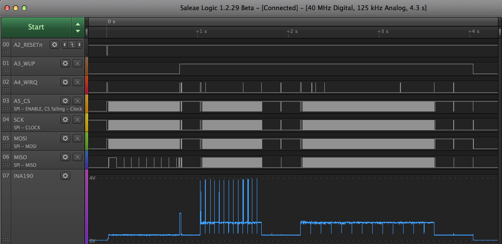
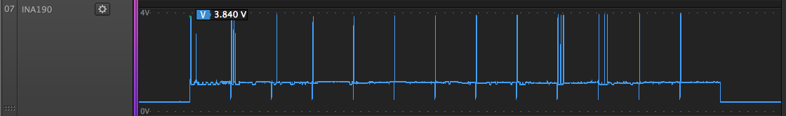
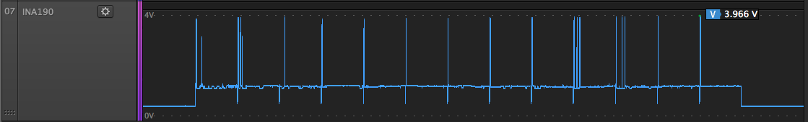
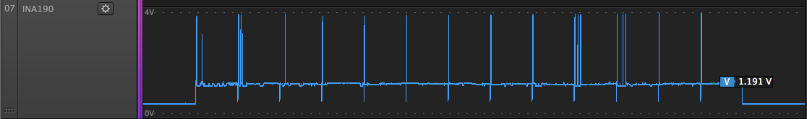
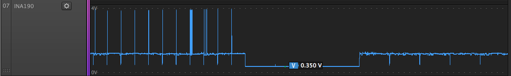
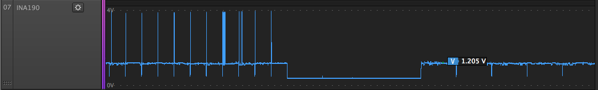
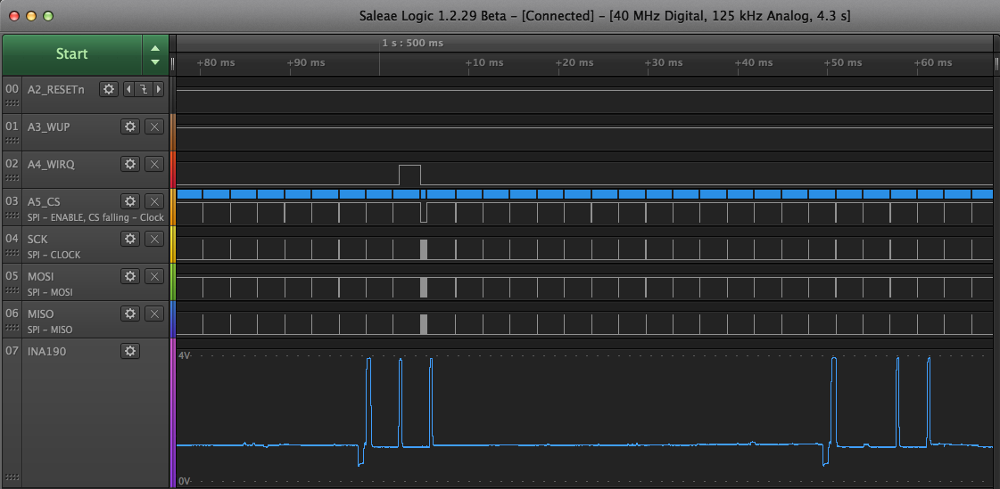
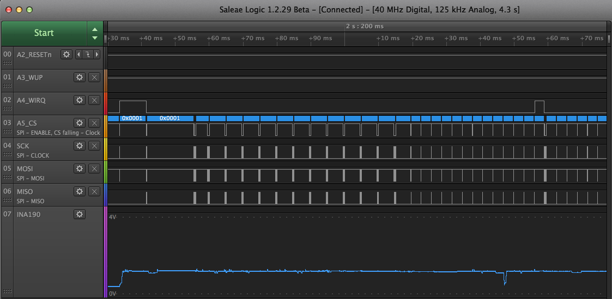

# exp17: HAL and SSID Scan

Objectives:

1. Add ifdefs and HAL to better encapsulate Arduino API dependencies for easy
   porting to other platforms

2. SSID scan

## Current Sense Captures

Saleae Logic 8 captures of 200V/V gain INA190 high-side current sense amplifier
inline with WF200 eval board VMCU.

Saleae Logic 8 calibrated voltage quantization step size appears to about
1.35mV, corresponding to a current measurement step size of 52µA (200 V/V gain
across 0.130Ω).

| INA190 Vout | gain    | R       | I (Vout/gain/R) | Comment                             |
|-------------|---------|---------|-----------------|-------------------------------------|
| 3.840 V     | 200 V/V | 0.130 Ω | 147.7 mA        | Active scan peak left end           |
| 3.966 V     | 200 V/V | 0.130 Ω | 152.5 mA        | Active scan peak right end          |
| 1.191 V     | 200 V/V | 0.130 Ω |  45.8 mA        | Active scan baseline                |
| 0.350 V     | 200 V/V | 0.130 Ω |  13.5 mA        | Idle between active and passive     |
| 1.205 V     | 200 V/V | 0.130 Ω |  46.3 mA        | Passive scan peak                   |


















## Console Log (serial monitor)

This uses the zero-buf branch of samblenny/wfx-fullMAC-driver at commit
[54842b4](https://github.com/samblenny/wfx-fullMAC-driver/commit/54842b4931d10a7119db337ba30ed2ff5dd6d959)

See [console_log.txt](console_log.txt)


## Test Circuit Wiring Guide

```
    Adafruit   Saleae   Silicon Laboratories   INA190EVM
  Feather M4   Logic8   BRD8022A EXP header    current sense
------------   ------   --------------------   -------------
         GND     GND    1  GND                 GND
          A2   0 blk    7  RESETn              --
          A3   1 brn    3  GPIO_WUP            --
          A4   2 red    12 SPI_WIRQ            --
          A5   3 org    10 SPI_CS              --
         SCK   4 yel    8  SPI_SCLK            --
        MOSI   5 grn    4  SPI_MOSI            --
        MISO   6 blu    6  SPI_MISO            --
(fake CS) 12     --     --                     --
   (5V)  USB     --     --                     VS  (INA190 Vs)
         3V3     --     20 3V3                 IN+ (0.130Ω shunt)
          --     --     2  VMCU                IN- (0.130Ω shunt)
          --   7 vlt    --                     OUT
```

Notes:
1. BRD8022A WF200 eval board switches should be set for "EXP VMCU" and "SPI".
2. BRD3022A needs 3.3V into both `3V3` and `VMCU`. `3V3` powers the GPIO mux
   chips and part of the reset circuit. `VMCU` powers the WF200 chip and the
   other part of the reset circuit.
3. INA190EVM is the 200 V/V gain variant (EVM kit comes with several boards) and
   it needs 5V to power the amplifier and 3.3V for the shunt resistor. Jumpers
   should be set for REF=GND and ENABLE=VS.
4. Feather M4's fake CS pin (`12`) is because M4 hardware SPI peripheral insists
   on doing 8-bit CS framing. WF200 expects 16-bit framing. Putting M4 8-bit CS
   on `12` makes it harmless. Real 16-bit CS gets bit-banged on pin `A5`.


## PDS File Setup

The purpose of a PDS file is to configure the WF200 radio and GPIO. For the
BRD8022A "WF200 Wi-Fi EXP Board" evaluation board from Silicon Laboratories,
there is a header file for the pre-defined PDS at
https://github.com/SiliconLabs/wfx-fullMAC-tools/blob/master/PDS/brd8022a_pds.h

To get the PDS header file, do this, starting from `exp17/`:
```
cd ../
mkdir -p wfx-fullMAC-tools/PDS
cd wfx-fullMAC-tools/PDS
curl -O https://raw.githubusercontent.com/SiliconLabs/wfx-fullMAC-tools/master/PDS/brd8022a_pds.h
# and a workaround for the Arduino IDE library include path...
cd ../../exp17
mkdir PDS
ln -s ../../wfx-fullMAC-tools/PDS/brd8022a_pds.h PDS/brd8022a_pds.h
```
